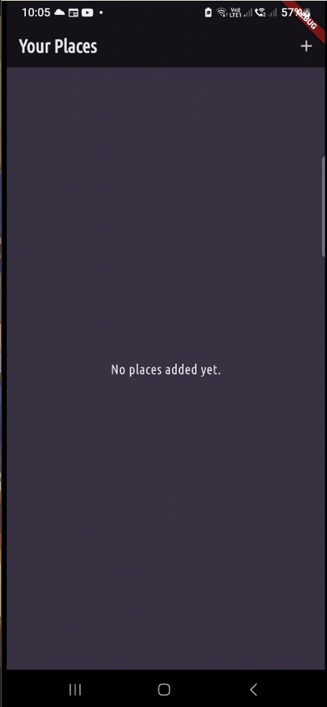
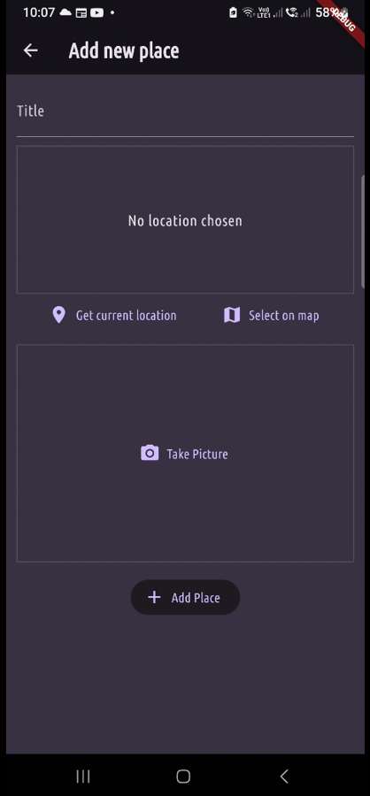
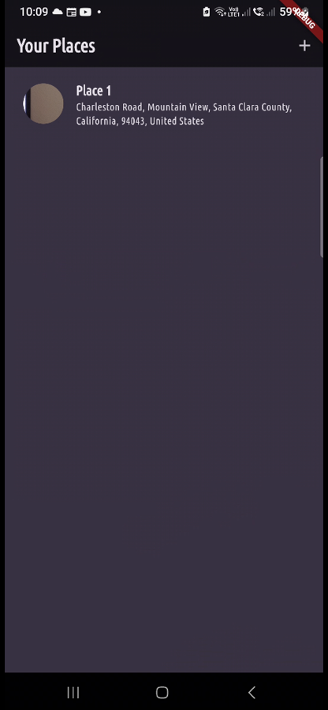
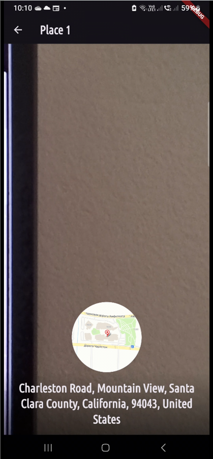

# The Favorite Places App
 

## About:
An app that allows users to add a place as a favorite  and customize it with a name and picture. 
## Features:
  - Uses Google Fonts
  - Uses Riverpod for state mangagement
  - Makes use of the users camera to take pictures
  - Map data from OpenStreet Maps

## Packages Used:
  - Google Fonts
  - UUID
  - Riverpod
  - Image Picker
  - Location
  - Flutter Map
  - HTTP
  - Latlong2
  - Path Provider
  - Path
  - SQFLite

## Images:
<table>
  <tr>
    <th>Screen Name</th>
    <th>Screenshot</th>
  </tr>
  <tr>
    <td><strong>Home Screen with no places</strong></td>
    <td></td>
  </tr>
  <tr>
    <td><strong>Add Place Screen</strong></td>
    <td></td>
  </tr>
  <tr>
    <td><strong>Home Screen with a place</strong></td>
    <td></td>
  </tr>
  <tr>
    <td><strong>Place Detail Screen</td>
    <td></td>
  </tr>
</table>
